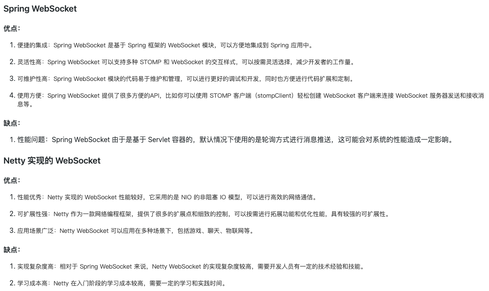

# netty-websocket-spring-boot 

## 前言

该项目之前是基于`spring-boot-starter-websocket`做的一个Demo，start还不错， 偶然间看到大佬基于
Netty实现了一个轻量级高性能的[Netty-Websocket框架](https://github.com/YeautyYE/netty-websocket-spring-boot-starter)， 
而且用法和`spring-boot-starter-websocket`一样，注解驱动，看到后感触很大， 觉得他很牛逼，看了下他的源码，
大致原理和技术知道了以后，觉得我之前也看过那么多的spring 源码，觉得我也能写出来，于是就强迫自己写了该项目，也算是
对源码的巩固，太久不看，确实很多又忘了。

## 介绍
基于Netty实现了大部分spring-websocket的功能，从下图能知道Spring-Websocket使用起来非常方便，但是性能方面相较于Netty实现的WebScoket性能会有
些差距，但是Netty做Websocket复杂度更高，为了让Netty实现WebSocket使用更简单，于是开发了这个starter,该starter使用起来可以和
spring-websocket一样简单，而且使用语法尽可能的和Spring-Websocket一致。



## 使用

添加maven依赖
```java
<dependency>
    <groupId>com.niezhiliang</groupId>
    <artifactId>netty-websocket-spring-boot-starter</artifactId>
    <version>0.0.1-SNAPSHOT</version>
</dependency>
```

```java
@WsServerEndpoint(value = "/websocket/{uid}/{arg}")
public class ServerEndpoint {

    @HandshakeBefore
    public void before (HttpHeaders headers) {
        System.out.println("before");
    }

    /**
     * 用户连接时触发
     * @param session
     */
    @OnOpen
    public void open(Session session, @PathParam (value="uid") String uid, @PathParam String arg){
        System.out.println("open");
        session.sendText("hello client");
    }

    /**
     * 收到信息时触发
     * @param message
     */
    @OnMessage
    public void onMessage(Session session,String message){
        System.out.println("message:" + message);
        session.sendText("server: " + message);
    }

    /**
     * 连接关闭触发
     */
    @OnClose
    public void onClose(){
        System.out.println("close  " + LocalDateTime.now());
    }

    /**
     * 发生错误时触发
     * @param session
     * @param e
     */
    @OnError
    public void onError(Session session, Throwable e) {
        System.out.println("onError");
    }

    /**
     * 发生事件时触发
     * @param session
     * @param evt
     */
    @OnEvent
    public void onEvent(Session session, Object evt) {
        if (evt instanceof IdleStateEvent) {
            // 心跳事件处理
        }
    }
}
```

## 收获
- Netty
- 自定义注解修饰Bean，并注入容器
- 扫描并回调自定义注解修饰方法
- 自动装配Starter
- 后置处理器`SmartInitializingSingleton`
- 适配器模式
- 方法参数解析
- 路由匹配、请求路由参数获取


